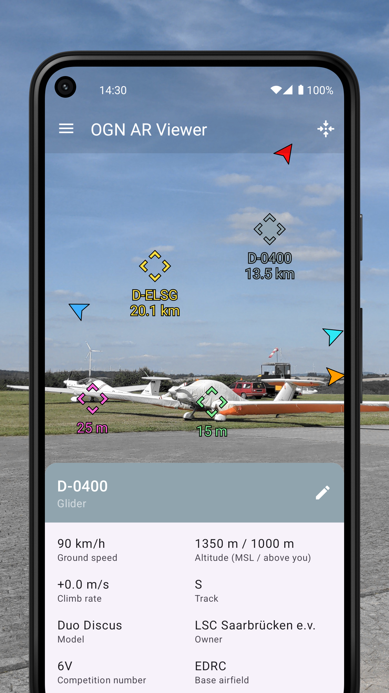

# OGN AR Viewer

This is the source code of an augmented reality Android client for the [Open Glider Network](https://www.glidernet.org) (OGN).

## Privacy note

The application needs to send your location to the OGN in order to listen for aircraft beacons around you and because the OGN doesn’t support encryption, this happens in clear text.
The good news is that OGN AR Viewer reduces the location accuracy to about 5 km before transmitting it and then restores it back on recipient, so the fine location never leaves your device.
It further anonymizes you by connecting to the OGN without identification (other clients based on the official library generate an identifier based on your hostname).
Check out the [privacy policy](https://ognarviewer.testcase.me/en/privacy.html) to learn more (it is written in simple language and has illustrations).
